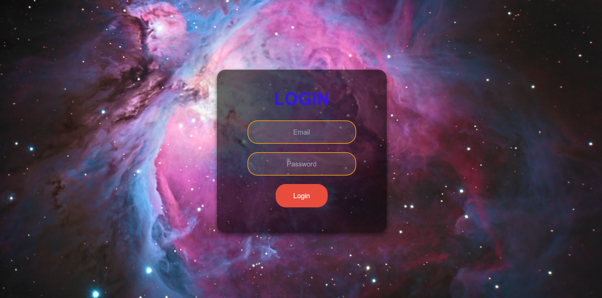
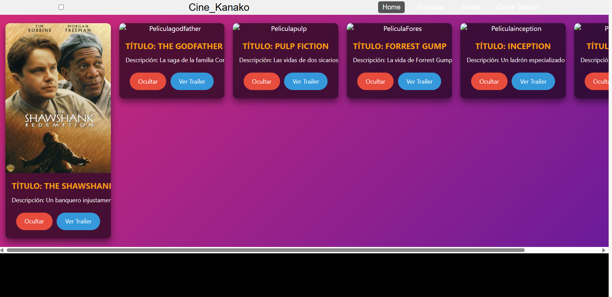

# HubMovies
Este proyecto fue generado con  [Angular CLI](https://github.com/angular/angular-cli) version 18.1.0.
# Autor
Julieta Jiménez

# Objetivos Principales REPO 2-3
Utilizar las herramientas necesarias para la creación de una plataforma recreativa de películas y series.
Hacer que la plataforma sea usable.
Emplear HTML, CSS y JavaScript.
# Servidor de Desarrollo
Ejecuta ng serve para iniciar el servidor de desarrollo. Navega a http://localhost:4200/. La aplicación se recargará automáticamente si realizas cambios en alguno de los archivos fuente.

# Programas Utilizados REPO 2-3

Node.js: v20.15.0
Plataforma Postman: Postman

# Descripción REPO 2-3
Se instalaron Angular y Node.js. Comencé con el esquema de colores de la página.
Empecé agregando la barra de navegación (Navbar) con la ayuda de Tailwind.
Configuré las rutas correspondientes para la primera carga de la página.
Creé el documento con las categorías de películas, añadiendo detalles utilizando JSON y Postman.
Trabajé por separado en la parte de inicio de sesión y en la vista de la plataforma usando HTML y CSS.
# Descripción REPO 2-3 Mejorado
A partir de los detalles y errores observados en los Sprints anteriores, se logró mejorar considerablemente en el uso de Angular. En esta ocasión, enfrenté errores que me impidieron avanzar, por lo que solicité mentorías y apoyo de mis compañeros. En pocos días, el apoyo en equipo permitió un avance significativo en el proyecto. Decidimos trabajar juntos y colaborar para superar las dificultades encontradas. Aunque aún nos queda tiempo para perfeccionar la página, estamos comprometidos a entregar un resultado satisfactorio para el próximo Sprint.
# Complicaciones REPO 2-3
~¿Qué hice mal?~
* No gestioné bien mi tiempo y me enfoqué en otro curso.
* Me centré en los errores del programa, reiniciándolo 3 veces.
  
~¿Qué salió mal?~
* Inicialmente, tuve problemas con la actualización de mi terminal.
* Al colocar las rutas, perdí el seguimiento y creé más objetos de los necesarios, lo cual me confundió.
* No logré alcanzar el objetivo propuesto.
  
~¿Qué puedo hacer diferente?~
* Consultar a expertos en el área para hacer preguntas.
* Gestionar mejor mi tiempo y no quedarme demasiado tiempo en los errores.
  
# Complicaciones REPO 2-3 RENOVADO
~¿Qué hice mal?~
* Tratar de remedeiar mis errores sin ver el tiempo que me tomaría resolverlos.
  
~¿Qué salió bien?~
* Comprendí mejor el funcionamiento de angular y las rutas de los componentes.
* El acercarme a mis compañeros y trabajar en equipo.
    
~¿Qué puedo hacer diferente?~
  Al no comprender del todo los poroblemas, seguir apoyandome de mis compañeros, dividirnos las tarea y explicarnos cualquier detalle, si nos organizamos podemos tener una mejor entrega.

    #Resultado Actualizado de lo que estaba realizando
    
Login

  
  Aún falta arreglar el que tome la base de datos y agregar el registro.

   
Página de Películas

  
  Falta ajustar el diseño, realizar las rutas con sus funciones.

# NOTA IMPORTANTE

* No pude agregar los cambios a mi Repositorio anterior, por eso agregué uno nuevo, me aparece que se hicieron los cambios pero al actualizar no se visualiza nada, una disculpa.
  
  
  

